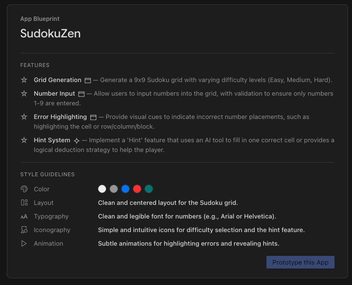
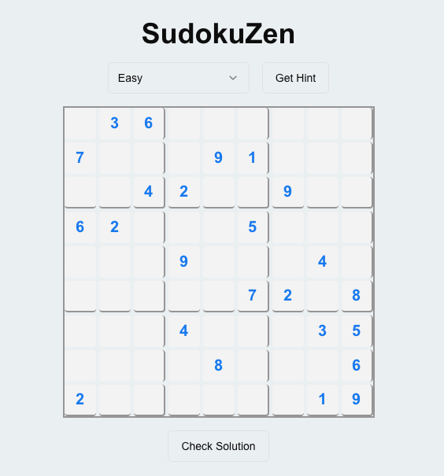

# Objective

To create a Sudoku game app with features to provide hints and check solution.

# Input/Prompt

# Blueprint

# Output/Generated App

You can explore the code of the app generated in [app folder](./app). 

